TestRun Done.
=====================
> 以下是一次典型的完整的内存清理过程，如果你其中代码段采用graphviz编写，如果你面前的内容无法显示该图片，请更换阅读器。推荐使用：**“vscode” + “graphviz markdown preview”**

## gc-ReferBuild-target[0x7ffeea59ea50]

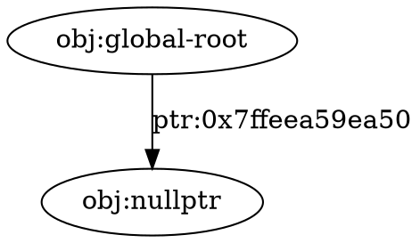
--------------------------------------------------------
## gc-ReferBuild-target[0x7fb372c027a0]

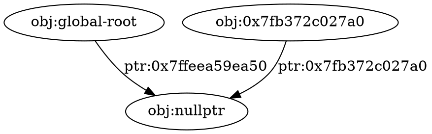
--------------------------------------------------------
## gc-ReferCancel-target[0x7ffeea59ea50]

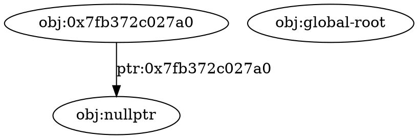
--------------------------------------------------------
## gc-ReferBuild-target[0x7ffeea59ea50]

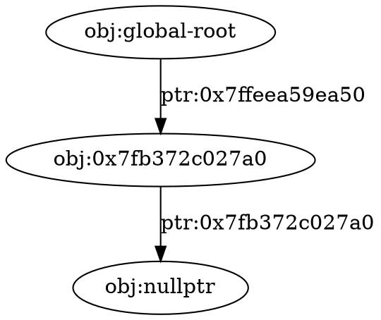
--------------------------------------------------------
## gc-ReferBuild-target[0x7ffeea59ea20]

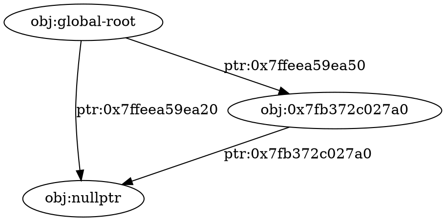
--------------------------------------------------------
## gc-ReferCancel-target[0x7ffeea59ea20]


--------------------------------------------------------
## gc-ReferBuild-target[0x7ffeea59ea20]

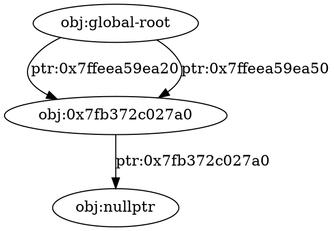
--------------------------------------------------------
## gc-ReferBuild-target[0x7fb372d00020]

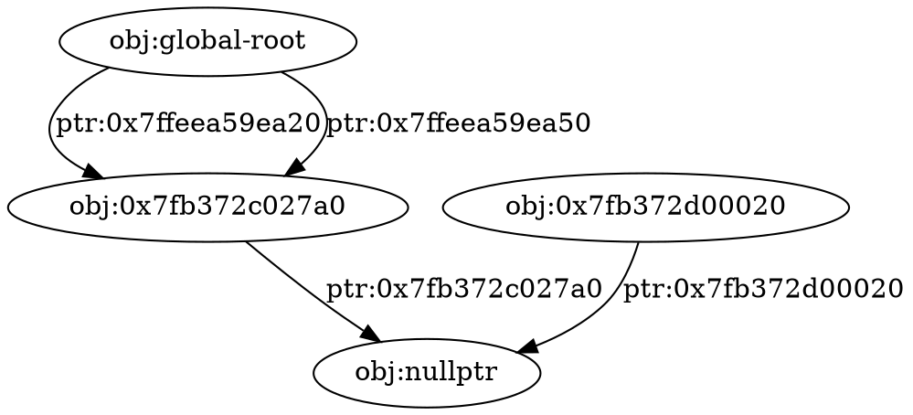
--------------------------------------------------------
## gc-ReferCancel-target[0x7ffeea59ea50]

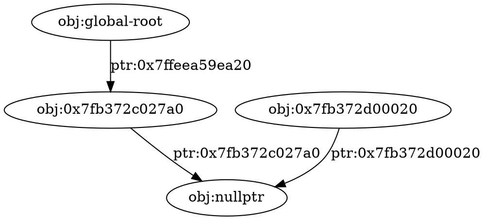
--------------------------------------------------------
## gc-ReferBuild-target[0x7ffeea59ea50]

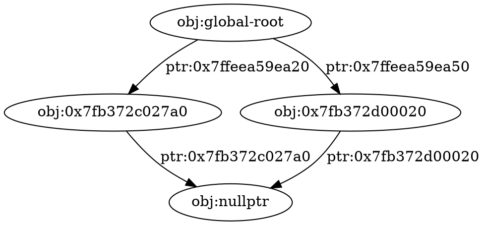
--------------------------------------------------------
## gc-ReferBuild-target[0x7fb372d00170]

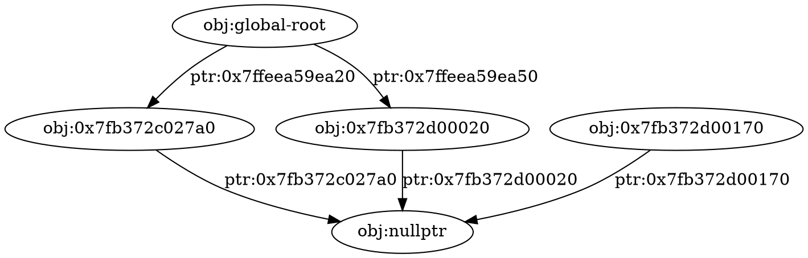
--------------------------------------------------------
## gc-ReferBuild-target[0x7ffeea59ea00]

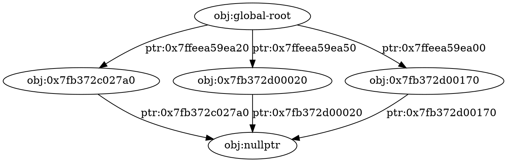
--------------------------------------------------------
## gc-ReferBuild-target[0x7ffeea59e9d8]

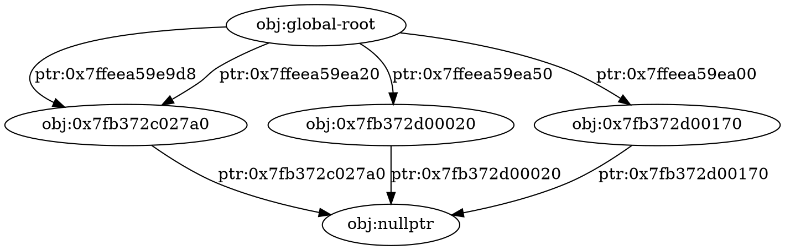
--------------------------------------------------------
## gc-ReferCancel-target[0x7fb372d00170]

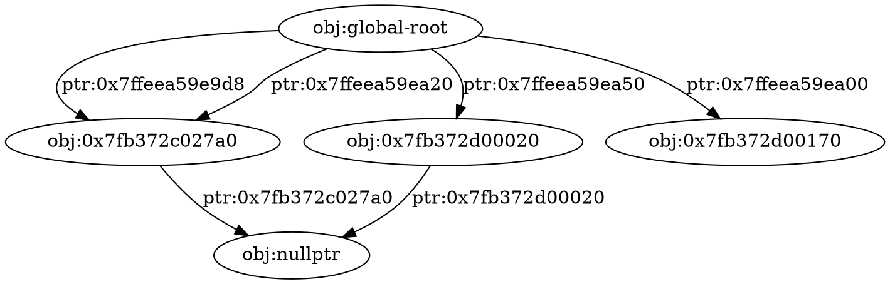
--------------------------------------------------------
## gc-ReferBuild-target[0x7fb372d00170]

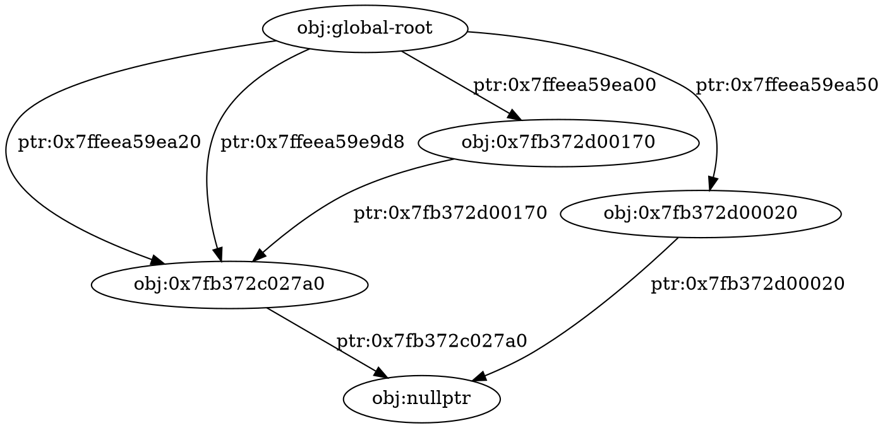
--------------------------------------------------------
## gc-ReferCancel-target[0x7ffeea59e9d8]

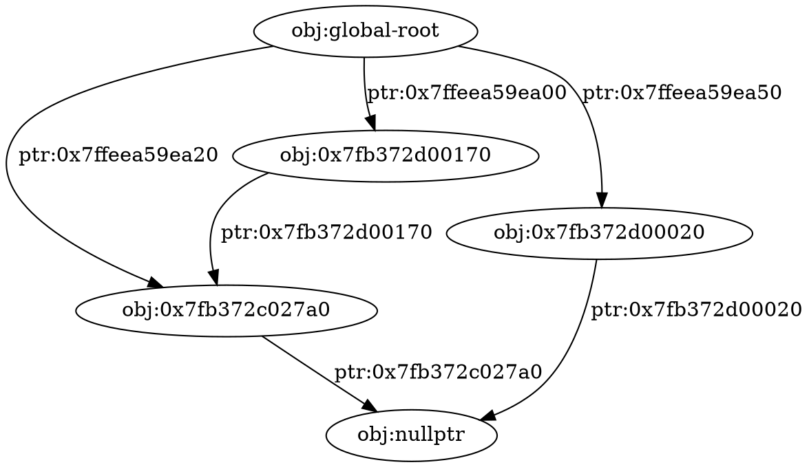
--------------------------------------------------------
## gc-ReferBuild-target[0x7ffeea59e9b8]

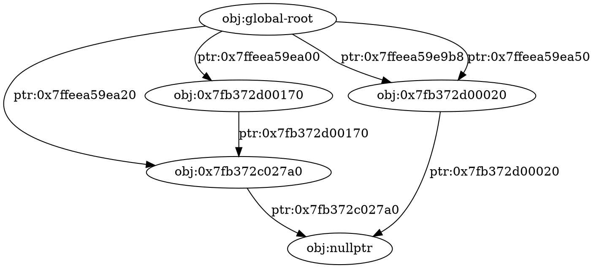
--------------------------------------------------------
## gc-ReferCancel-target[0x7fb372c027a0]

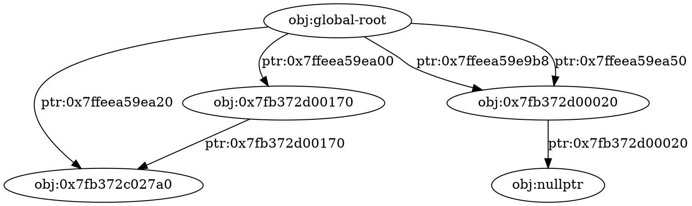
--------------------------------------------------------
## gc-ReferBuild-target[0x7fb372c027a0]

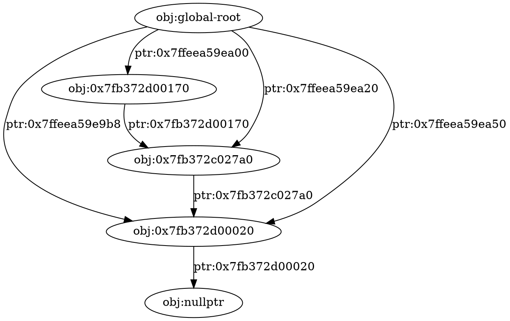
--------------------------------------------------------
## gc-ReferCancel-target[0x7ffeea59e9b8]

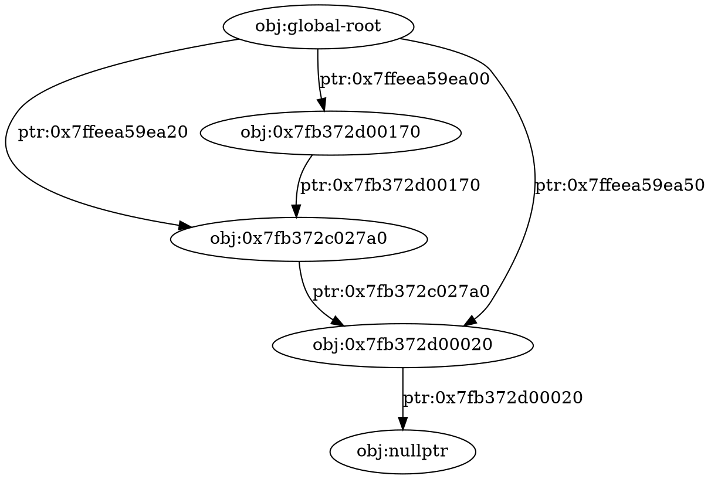
--------------------------------------------------------
## gc-ReferBuild-target[0x7ffeea59e998]

```graphviz
digraph stack_tracker{ 
node_0[label="obj:nullptr"]
node_1[label="obj:global-root"]
node_2[label="obj:0x7fb372c027a0"]
node_4[label="obj:0x7fb372d00020"]
node_3[label="obj:0x7fb372d00170"]
node_1->node_2 [label="ptr:0x7ffeea59e998"];
node_1->node_3 [label="ptr:0x7ffeea59ea00"];
node_1->node_2 [label="ptr:0x7ffeea59ea20"];
node_1->node_4 [label="ptr:0x7ffeea59ea50"];
node_2->node_4 [label="ptr:0x7fb372c027a0"];
node_4->node_0 [label="ptr:0x7fb372d00020"];
node_3->node_2 [label="ptr:0x7fb372d00170"];
}
```
--------------------------------------------------------
## gc-ReferCancel-target[0x7fb372d00020]

```graphviz
digraph stack_tracker{ 
node_0[label="obj:global-root"]
node_1[label="obj:0x7fb372c027a0"]
node_3[label="obj:0x7fb372d00020"]
node_2[label="obj:0x7fb372d00170"]
node_0->node_1 [label="ptr:0x7ffeea59e998"];
node_0->node_2 [label="ptr:0x7ffeea59ea00"];
node_0->node_1 [label="ptr:0x7ffeea59ea20"];
node_0->node_3 [label="ptr:0x7ffeea59ea50"];
node_1->node_3 [label="ptr:0x7fb372c027a0"];
node_2->node_1 [label="ptr:0x7fb372d00170"];
}
```
--------------------------------------------------------
## gc-ReferBuild-target[0x7fb372d00020]

```graphviz
digraph stack_tracker{ 
node_0[label="obj:global-root"]
node_1[label="obj:0x7fb372c027a0"]
node_3[label="obj:0x7fb372d00020"]
node_2[label="obj:0x7fb372d00170"]
node_0->node_1 [label="ptr:0x7ffeea59e998"];
node_0->node_2 [label="ptr:0x7ffeea59ea00"];
node_0->node_1 [label="ptr:0x7ffeea59ea20"];
node_0->node_3 [label="ptr:0x7ffeea59ea50"];
node_1->node_3 [label="ptr:0x7fb372c027a0"];
node_3->node_1 [label="ptr:0x7fb372d00020"];
node_2->node_1 [label="ptr:0x7fb372d00170"];
}
```
--------------------------------------------------------
## gc-ReferCancel-target[0x7ffeea59e998]

```graphviz
digraph stack_tracker{ 
node_0[label="obj:global-root"]
node_2[label="obj:0x7fb372c027a0"]
node_3[label="obj:0x7fb372d00020"]
node_1[label="obj:0x7fb372d00170"]
node_0->node_1 [label="ptr:0x7ffeea59ea00"];
node_0->node_2 [label="ptr:0x7ffeea59ea20"];
node_0->node_3 [label="ptr:0x7ffeea59ea50"];
node_2->node_3 [label="ptr:0x7fb372c027a0"];
node_3->node_2 [label="ptr:0x7fb372d00020"];
node_1->node_2 [label="ptr:0x7fb372d00170"];
}
```
--------------------------------------------------------
## gc-ReferBuild-target[0x7fb372d006b0]

```graphviz
digraph stack_tracker{ 
node_0[label="obj:nullptr"]
node_1[label="obj:global-root"]
node_3[label="obj:0x7fb372c027a0"]
node_4[label="obj:0x7fb372d00020"]
node_2[label="obj:0x7fb372d00170"]
node_5[label="obj:0x7fb372d006b0"]
node_1->node_2 [label="ptr:0x7ffeea59ea00"];
node_1->node_3 [label="ptr:0x7ffeea59ea20"];
node_1->node_4 [label="ptr:0x7ffeea59ea50"];
node_3->node_4 [label="ptr:0x7fb372c027a0"];
node_4->node_3 [label="ptr:0x7fb372d00020"];
node_2->node_3 [label="ptr:0x7fb372d00170"];
node_5->node_0 [label="ptr:0x7fb372d006b0"];
}
```
--------------------------------------------------------
## gc-ReferBuild-target[0x7ffeea59e978]

```graphviz
digraph stack_tracker{ 
node_0[label="obj:nullptr"]
node_1[label="obj:global-root"]
node_4[label="obj:0x7fb372c027a0"]
node_5[label="obj:0x7fb372d00020"]
node_3[label="obj:0x7fb372d00170"]
node_2[label="obj:0x7fb372d006b0"]
node_1->node_2 [label="ptr:0x7ffeea59e978"];
node_1->node_3 [label="ptr:0x7ffeea59ea00"];
node_1->node_4 [label="ptr:0x7ffeea59ea20"];
node_1->node_5 [label="ptr:0x7ffeea59ea50"];
node_4->node_5 [label="ptr:0x7fb372c027a0"];
node_5->node_4 [label="ptr:0x7fb372d00020"];
node_3->node_4 [label="ptr:0x7fb372d00170"];
node_2->node_0 [label="ptr:0x7fb372d006b0"];
}
```
--------------------------------------------------------
## gc-ReferBuild-target[0x7fb372d007a0]

```graphviz
digraph stack_tracker{ 
node_0[label="obj:nullptr"]
node_1[label="obj:global-root"]
node_4[label="obj:0x7fb372c027a0"]
node_5[label="obj:0x7fb372d00020"]
node_3[label="obj:0x7fb372d00170"]
node_2[label="obj:0x7fb372d006b0"]
node_6[label="obj:0x7fb372d007a0"]
node_1->node_2 [label="ptr:0x7ffeea59e978"];
node_1->node_3 [label="ptr:0x7ffeea59ea00"];
node_1->node_4 [label="ptr:0x7ffeea59ea20"];
node_1->node_5 [label="ptr:0x7ffeea59ea50"];
node_4->node_5 [label="ptr:0x7fb372c027a0"];
node_5->node_4 [label="ptr:0x7fb372d00020"];
node_3->node_4 [label="ptr:0x7fb372d00170"];
node_2->node_0 [label="ptr:0x7fb372d006b0"];
node_6->node_0 [label="ptr:0x7fb372d007a0"];
}
```
--------------------------------------------------------
## gc-ReferBuild-target[0x7ffeea59e958]

```graphviz
digraph stack_tracker{ 
node_0[label="obj:nullptr"]
node_1[label="obj:global-root"]
node_5[label="obj:0x7fb372c027a0"]
node_6[label="obj:0x7fb372d00020"]
node_4[label="obj:0x7fb372d00170"]
node_3[label="obj:0x7fb372d006b0"]
node_2[label="obj:0x7fb372d007a0"]
node_1->node_2 [label="ptr:0x7ffeea59e958"];
node_1->node_3 [label="ptr:0x7ffeea59e978"];
node_1->node_4 [label="ptr:0x7ffeea59ea00"];
node_1->node_5 [label="ptr:0x7ffeea59ea20"];
node_1->node_6 [label="ptr:0x7ffeea59ea50"];
node_5->node_6 [label="ptr:0x7fb372c027a0"];
node_6->node_5 [label="ptr:0x7fb372d00020"];
node_4->node_5 [label="ptr:0x7fb372d00170"];
node_3->node_0 [label="ptr:0x7fb372d006b0"];
node_2->node_0 [label="ptr:0x7fb372d007a0"];
}
```
--------------------------------------------------------
## gc-ReferBuild-target[0x7fb372d008a0]

```graphviz
digraph stack_tracker{ 
node_0[label="obj:nullptr"]
node_1[label="obj:global-root"]
node_5[label="obj:0x7fb372c027a0"]
node_6[label="obj:0x7fb372d00020"]
node_4[label="obj:0x7fb372d00170"]
node_3[label="obj:0x7fb372d006b0"]
node_2[label="obj:0x7fb372d007a0"]
node_7[label="obj:0x7fb372d008a0"]
node_1->node_2 [label="ptr:0x7ffeea59e958"];
node_1->node_3 [label="ptr:0x7ffeea59e978"];
node_1->node_4 [label="ptr:0x7ffeea59ea00"];
node_1->node_5 [label="ptr:0x7ffeea59ea20"];
node_1->node_6 [label="ptr:0x7ffeea59ea50"];
node_5->node_6 [label="ptr:0x7fb372c027a0"];
node_6->node_5 [label="ptr:0x7fb372d00020"];
node_4->node_5 [label="ptr:0x7fb372d00170"];
node_3->node_0 [label="ptr:0x7fb372d006b0"];
node_2->node_0 [label="ptr:0x7fb372d007a0"];
node_7->node_0 [label="ptr:0x7fb372d008a0"];
}
```
--------------------------------------------------------
## gc-ReferBuild-target[0x7ffeea59e938]

```graphviz
digraph stack_tracker{ 
node_0[label="obj:nullptr"]
node_1[label="obj:global-root"]
node_6[label="obj:0x7fb372c027a0"]
node_7[label="obj:0x7fb372d00020"]
node_5[label="obj:0x7fb372d00170"]
node_4[label="obj:0x7fb372d006b0"]
node_3[label="obj:0x7fb372d007a0"]
node_2[label="obj:0x7fb372d008a0"]
node_1->node_2 [label="ptr:0x7ffeea59e938"];
node_1->node_3 [label="ptr:0x7ffeea59e958"];
node_1->node_4 [label="ptr:0x7ffeea59e978"];
node_1->node_5 [label="ptr:0x7ffeea59ea00"];
node_1->node_6 [label="ptr:0x7ffeea59ea20"];
node_1->node_7 [label="ptr:0x7ffeea59ea50"];
node_6->node_7 [label="ptr:0x7fb372c027a0"];
node_7->node_6 [label="ptr:0x7fb372d00020"];
node_5->node_6 [label="ptr:0x7fb372d00170"];
node_4->node_0 [label="ptr:0x7fb372d006b0"];
node_3->node_0 [label="ptr:0x7fb372d007a0"];
node_2->node_0 [label="ptr:0x7fb372d008a0"];
}
```
--------------------------------------------------------
## gc-ReferBuild-target[0x7fb372d009a0]

```graphviz
digraph stack_tracker{ 
node_0[label="obj:nullptr"]
node_1[label="obj:global-root"]
node_6[label="obj:0x7fb372c027a0"]
node_7[label="obj:0x7fb372d00020"]
node_5[label="obj:0x7fb372d00170"]
node_4[label="obj:0x7fb372d006b0"]
node_3[label="obj:0x7fb372d007a0"]
node_2[label="obj:0x7fb372d008a0"]
node_8[label="obj:0x7fb372d009a0"]
node_1->node_2 [label="ptr:0x7ffeea59e938"];
node_1->node_3 [label="ptr:0x7ffeea59e958"];
node_1->node_4 [label="ptr:0x7ffeea59e978"];
node_1->node_5 [label="ptr:0x7ffeea59ea00"];
node_1->node_6 [label="ptr:0x7ffeea59ea20"];
node_1->node_7 [label="ptr:0x7ffeea59ea50"];
node_6->node_7 [label="ptr:0x7fb372c027a0"];
node_7->node_6 [label="ptr:0x7fb372d00020"];
node_5->node_6 [label="ptr:0x7fb372d00170"];
node_4->node_0 [label="ptr:0x7fb372d006b0"];
node_3->node_0 [label="ptr:0x7fb372d007a0"];
node_2->node_0 [label="ptr:0x7fb372d008a0"];
node_8->node_0 [label="ptr:0x7fb372d009a0"];
}
```
--------------------------------------------------------
## gc-ReferBuild-target[0x7ffeea59e918]

```graphviz
digraph stack_tracker{ 
node_0[label="obj:nullptr"]
node_1[label="obj:global-root"]
node_7[label="obj:0x7fb372c027a0"]
node_8[label="obj:0x7fb372d00020"]
node_6[label="obj:0x7fb372d00170"]
node_5[label="obj:0x7fb372d006b0"]
node_4[label="obj:0x7fb372d007a0"]
node_3[label="obj:0x7fb372d008a0"]
node_2[label="obj:0x7fb372d009a0"]
node_1->node_2 [label="ptr:0x7ffeea59e918"];
node_1->node_3 [label="ptr:0x7ffeea59e938"];
node_1->node_4 [label="ptr:0x7ffeea59e958"];
node_1->node_5 [label="ptr:0x7ffeea59e978"];
node_1->node_6 [label="ptr:0x7ffeea59ea00"];
node_1->node_7 [label="ptr:0x7ffeea59ea20"];
node_1->node_8 [label="ptr:0x7ffeea59ea50"];
node_7->node_8 [label="ptr:0x7fb372c027a0"];
node_8->node_7 [label="ptr:0x7fb372d00020"];
node_6->node_7 [label="ptr:0x7fb372d00170"];
node_5->node_0 [label="ptr:0x7fb372d006b0"];
node_4->node_0 [label="ptr:0x7fb372d007a0"];
node_3->node_0 [label="ptr:0x7fb372d008a0"];
node_2->node_0 [label="ptr:0x7fb372d009a0"];
}
```
--------------------------------------------------------
## gc-ReferBuild-target[0x7ffeea59e8f8]

```graphviz
digraph stack_tracker{ 
node_0[label="obj:nullptr"]
node_1[label="obj:global-root"]
node_7[label="obj:0x7fb372c027a0"]
node_8[label="obj:0x7fb372d00020"]
node_6[label="obj:0x7fb372d00170"]
node_2[label="obj:0x7fb372d006b0"]
node_5[label="obj:0x7fb372d007a0"]
node_4[label="obj:0x7fb372d008a0"]
node_3[label="obj:0x7fb372d009a0"]
node_1->node_2 [label="ptr:0x7ffeea59e8f8"];
node_1->node_3 [label="ptr:0x7ffeea59e918"];
node_1->node_4 [label="ptr:0x7ffeea59e938"];
node_1->node_5 [label="ptr:0x7ffeea59e958"];
node_1->node_2 [label="ptr:0x7ffeea59e978"];
node_1->node_6 [label="ptr:0x7ffeea59ea00"];
node_1->node_7 [label="ptr:0x7ffeea59ea20"];
node_1->node_8 [label="ptr:0x7ffeea59ea50"];
node_7->node_8 [label="ptr:0x7fb372c027a0"];
node_8->node_7 [label="ptr:0x7fb372d00020"];
node_6->node_7 [label="ptr:0x7fb372d00170"];
node_2->node_0 [label="ptr:0x7fb372d006b0"];
node_5->node_0 [label="ptr:0x7fb372d007a0"];
node_4->node_0 [label="ptr:0x7fb372d008a0"];
node_3->node_0 [label="ptr:0x7fb372d009a0"];
}
```
--------------------------------------------------------
## gc-ReferCancel-target[0x7fb372d009a0]

```graphviz
digraph stack_tracker{ 
node_0[label="obj:nullptr"]
node_1[label="obj:global-root"]
node_7[label="obj:0x7fb372c027a0"]
node_8[label="obj:0x7fb372d00020"]
node_6[label="obj:0x7fb372d00170"]
node_2[label="obj:0x7fb372d006b0"]
node_5[label="obj:0x7fb372d007a0"]
node_4[label="obj:0x7fb372d008a0"]
node_3[label="obj:0x7fb372d009a0"]
node_1->node_2 [label="ptr:0x7ffeea59e8f8"];
node_1->node_3 [label="ptr:0x7ffeea59e918"];
node_1->node_4 [label="ptr:0x7ffeea59e938"];
node_1->node_5 [label="ptr:0x7ffeea59e958"];
node_1->node_2 [label="ptr:0x7ffeea59e978"];
node_1->node_6 [label="ptr:0x7ffeea59ea00"];
node_1->node_7 [label="ptr:0x7ffeea59ea20"];
node_1->node_8 [label="ptr:0x7ffeea59ea50"];
node_7->node_8 [label="ptr:0x7fb372c027a0"];
node_8->node_7 [label="ptr:0x7fb372d00020"];
node_6->node_7 [label="ptr:0x7fb372d00170"];
node_2->node_0 [label="ptr:0x7fb372d006b0"];
node_5->node_0 [label="ptr:0x7fb372d007a0"];
node_4->node_0 [label="ptr:0x7fb372d008a0"];
}
```
--------------------------------------------------------
## gc-ReferBuild-target[0x7fb372d009a0]

```graphviz
digraph stack_tracker{ 
node_0[label="obj:nullptr"]
node_1[label="obj:global-root"]
node_7[label="obj:0x7fb372c027a0"]
node_8[label="obj:0x7fb372d00020"]
node_6[label="obj:0x7fb372d00170"]
node_2[label="obj:0x7fb372d006b0"]
node_5[label="obj:0x7fb372d007a0"]
node_4[label="obj:0x7fb372d008a0"]
node_3[label="obj:0x7fb372d009a0"]
node_1->node_2 [label="ptr:0x7ffeea59e8f8"];
node_1->node_3 [label="ptr:0x7ffeea59e918"];
node_1->node_4 [label="ptr:0x7ffeea59e938"];
node_1->node_5 [label="ptr:0x7ffeea59e958"];
node_1->node_2 [label="ptr:0x7ffeea59e978"];
node_1->node_6 [label="ptr:0x7ffeea59ea00"];
node_1->node_7 [label="ptr:0x7ffeea59ea20"];
node_1->node_8 [label="ptr:0x7ffeea59ea50"];
node_7->node_8 [label="ptr:0x7fb372c027a0"];
node_8->node_7 [label="ptr:0x7fb372d00020"];
node_6->node_7 [label="ptr:0x7fb372d00170"];
node_2->node_0 [label="ptr:0x7fb372d006b0"];
node_5->node_0 [label="ptr:0x7fb372d007a0"];
node_4->node_0 [label="ptr:0x7fb372d008a0"];
node_3->node_2 [label="ptr:0x7fb372d009a0"];
}
```
--------------------------------------------------------
## gc-ReferCancel-target[0x7ffeea59e8f8]

```graphviz
digraph stack_tracker{ 
node_0[label="obj:nullptr"]
node_1[label="obj:global-root"]
node_7[label="obj:0x7fb372c027a0"]
node_8[label="obj:0x7fb372d00020"]
node_6[label="obj:0x7fb372d00170"]
node_5[label="obj:0x7fb372d006b0"]
node_4[label="obj:0x7fb372d007a0"]
node_3[label="obj:0x7fb372d008a0"]
node_2[label="obj:0x7fb372d009a0"]
node_1->node_2 [label="ptr:0x7ffeea59e918"];
node_1->node_3 [label="ptr:0x7ffeea59e938"];
node_1->node_4 [label="ptr:0x7ffeea59e958"];
node_1->node_5 [label="ptr:0x7ffeea59e978"];
node_1->node_6 [label="ptr:0x7ffeea59ea00"];
node_1->node_7 [label="ptr:0x7ffeea59ea20"];
node_1->node_8 [label="ptr:0x7ffeea59ea50"];
node_7->node_8 [label="ptr:0x7fb372c027a0"];
node_8->node_7 [label="ptr:0x7fb372d00020"];
node_6->node_7 [label="ptr:0x7fb372d00170"];
node_5->node_0 [label="ptr:0x7fb372d006b0"];
node_4->node_0 [label="ptr:0x7fb372d007a0"];
node_3->node_0 [label="ptr:0x7fb372d008a0"];
node_2->node_5 [label="ptr:0x7fb372d009a0"];
}
```
--------------------------------------------------------
## gc-ReferBuild-target[0x7ffeea59e8d8]

```graphviz
digraph stack_tracker{ 
node_0[label="obj:nullptr"]
node_1[label="obj:global-root"]
node_7[label="obj:0x7fb372c027a0"]
node_8[label="obj:0x7fb372d00020"]
node_6[label="obj:0x7fb372d00170"]
node_5[label="obj:0x7fb372d006b0"]
node_2[label="obj:0x7fb372d007a0"]
node_4[label="obj:0x7fb372d008a0"]
node_3[label="obj:0x7fb372d009a0"]
node_1->node_2 [label="ptr:0x7ffeea59e8d8"];
node_1->node_3 [label="ptr:0x7ffeea59e918"];
node_1->node_4 [label="ptr:0x7ffeea59e938"];
node_1->node_2 [label="ptr:0x7ffeea59e958"];
node_1->node_5 [label="ptr:0x7ffeea59e978"];
node_1->node_6 [label="ptr:0x7ffeea59ea00"];
node_1->node_7 [label="ptr:0x7ffeea59ea20"];
node_1->node_8 [label="ptr:0x7ffeea59ea50"];
node_7->node_8 [label="ptr:0x7fb372c027a0"];
node_8->node_7 [label="ptr:0x7fb372d00020"];
node_6->node_7 [label="ptr:0x7fb372d00170"];
node_5->node_0 [label="ptr:0x7fb372d006b0"];
node_2->node_0 [label="ptr:0x7fb372d007a0"];
node_4->node_0 [label="ptr:0x7fb372d008a0"];
node_3->node_5 [label="ptr:0x7fb372d009a0"];
}
```
--------------------------------------------------------
## gc-ReferCancel-target[0x7fb372d006b0]

```graphviz
digraph stack_tracker{ 
node_0[label="obj:nullptr"]
node_1[label="obj:global-root"]
node_7[label="obj:0x7fb372c027a0"]
node_8[label="obj:0x7fb372d00020"]
node_6[label="obj:0x7fb372d00170"]
node_5[label="obj:0x7fb372d006b0"]
node_2[label="obj:0x7fb372d007a0"]
node_4[label="obj:0x7fb372d008a0"]
node_3[label="obj:0x7fb372d009a0"]
node_1->node_2 [label="ptr:0x7ffeea59e8d8"];
node_1->node_3 [label="ptr:0x7ffeea59e918"];
node_1->node_4 [label="ptr:0x7ffeea59e938"];
node_1->node_2 [label="ptr:0x7ffeea59e958"];
node_1->node_5 [label="ptr:0x7ffeea59e978"];
node_1->node_6 [label="ptr:0x7ffeea59ea00"];
node_1->node_7 [label="ptr:0x7ffeea59ea20"];
node_1->node_8 [label="ptr:0x7ffeea59ea50"];
node_7->node_8 [label="ptr:0x7fb372c027a0"];
node_8->node_7 [label="ptr:0x7fb372d00020"];
node_6->node_7 [label="ptr:0x7fb372d00170"];
node_2->node_0 [label="ptr:0x7fb372d007a0"];
node_4->node_0 [label="ptr:0x7fb372d008a0"];
node_3->node_5 [label="ptr:0x7fb372d009a0"];
}
```
--------------------------------------------------------
## gc-ReferBuild-target[0x7fb372d006b0]

```graphviz
digraph stack_tracker{ 
node_0[label="obj:nullptr"]
node_1[label="obj:global-root"]
node_7[label="obj:0x7fb372c027a0"]
node_8[label="obj:0x7fb372d00020"]
node_6[label="obj:0x7fb372d00170"]
node_5[label="obj:0x7fb372d006b0"]
node_2[label="obj:0x7fb372d007a0"]
node_4[label="obj:0x7fb372d008a0"]
node_3[label="obj:0x7fb372d009a0"]
node_1->node_2 [label="ptr:0x7ffeea59e8d8"];
node_1->node_3 [label="ptr:0x7ffeea59e918"];
node_1->node_4 [label="ptr:0x7ffeea59e938"];
node_1->node_2 [label="ptr:0x7ffeea59e958"];
node_1->node_5 [label="ptr:0x7ffeea59e978"];
node_1->node_6 [label="ptr:0x7ffeea59ea00"];
node_1->node_7 [label="ptr:0x7ffeea59ea20"];
node_1->node_8 [label="ptr:0x7ffeea59ea50"];
node_7->node_8 [label="ptr:0x7fb372c027a0"];
node_8->node_7 [label="ptr:0x7fb372d00020"];
node_6->node_7 [label="ptr:0x7fb372d00170"];
node_5->node_2 [label="ptr:0x7fb372d006b0"];
node_2->node_0 [label="ptr:0x7fb372d007a0"];
node_4->node_0 [label="ptr:0x7fb372d008a0"];
node_3->node_5 [label="ptr:0x7fb372d009a0"];
}
```
--------------------------------------------------------
## gc-ReferCancel-target[0x7ffeea59e8d8]

```graphviz
digraph stack_tracker{ 
node_0[label="obj:nullptr"]
node_1[label="obj:global-root"]
node_7[label="obj:0x7fb372c027a0"]
node_8[label="obj:0x7fb372d00020"]
node_6[label="obj:0x7fb372d00170"]
node_5[label="obj:0x7fb372d006b0"]
node_4[label="obj:0x7fb372d007a0"]
node_3[label="obj:0x7fb372d008a0"]
node_2[label="obj:0x7fb372d009a0"]
node_1->node_2 [label="ptr:0x7ffeea59e918"];
node_1->node_3 [label="ptr:0x7ffeea59e938"];
node_1->node_4 [label="ptr:0x7ffeea59e958"];
node_1->node_5 [label="ptr:0x7ffeea59e978"];
node_1->node_6 [label="ptr:0x7ffeea59ea00"];
node_1->node_7 [label="ptr:0x7ffeea59ea20"];
node_1->node_8 [label="ptr:0x7ffeea59ea50"];
node_7->node_8 [label="ptr:0x7fb372c027a0"];
node_8->node_7 [label="ptr:0x7fb372d00020"];
node_6->node_7 [label="ptr:0x7fb372d00170"];
node_5->node_4 [label="ptr:0x7fb372d006b0"];
node_4->node_0 [label="ptr:0x7fb372d007a0"];
node_3->node_0 [label="ptr:0x7fb372d008a0"];
node_2->node_5 [label="ptr:0x7fb372d009a0"];
}
```
--------------------------------------------------------
## gc-ReferBuild-target[0x7ffeea59e8b8]

```graphviz
digraph stack_tracker{ 
node_0[label="obj:nullptr"]
node_1[label="obj:global-root"]
node_7[label="obj:0x7fb372c027a0"]
node_8[label="obj:0x7fb372d00020"]
node_6[label="obj:0x7fb372d00170"]
node_5[label="obj:0x7fb372d006b0"]
node_4[label="obj:0x7fb372d007a0"]
node_2[label="obj:0x7fb372d008a0"]
node_3[label="obj:0x7fb372d009a0"]
node_1->node_2 [label="ptr:0x7ffeea59e8b8"];
node_1->node_3 [label="ptr:0x7ffeea59e918"];
node_1->node_2 [label="ptr:0x7ffeea59e938"];
node_1->node_4 [label="ptr:0x7ffeea59e958"];
node_1->node_5 [label="ptr:0x7ffeea59e978"];
node_1->node_6 [label="ptr:0x7ffeea59ea00"];
node_1->node_7 [label="ptr:0x7ffeea59ea20"];
node_1->node_8 [label="ptr:0x7ffeea59ea50"];
node_7->node_8 [label="ptr:0x7fb372c027a0"];
node_8->node_7 [label="ptr:0x7fb372d00020"];
node_6->node_7 [label="ptr:0x7fb372d00170"];
node_5->node_4 [label="ptr:0x7fb372d006b0"];
node_4->node_0 [label="ptr:0x7fb372d007a0"];
node_2->node_0 [label="ptr:0x7fb372d008a0"];
node_3->node_5 [label="ptr:0x7fb372d009a0"];
}
```
--------------------------------------------------------
## gc-ReferCancel-target[0x7fb372d007a0]

```graphviz
digraph stack_tracker{ 
node_0[label="obj:nullptr"]
node_1[label="obj:global-root"]
node_7[label="obj:0x7fb372c027a0"]
node_8[label="obj:0x7fb372d00020"]
node_6[label="obj:0x7fb372d00170"]
node_5[label="obj:0x7fb372d006b0"]
node_4[label="obj:0x7fb372d007a0"]
node_2[label="obj:0x7fb372d008a0"]
node_3[label="obj:0x7fb372d009a0"]
node_1->node_2 [label="ptr:0x7ffeea59e8b8"];
node_1->node_3 [label="ptr:0x7ffeea59e918"];
node_1->node_2 [label="ptr:0x7ffeea59e938"];
node_1->node_4 [label="ptr:0x7ffeea59e958"];
node_1->node_5 [label="ptr:0x7ffeea59e978"];
node_1->node_6 [label="ptr:0x7ffeea59ea00"];
node_1->node_7 [label="ptr:0x7ffeea59ea20"];
node_1->node_8 [label="ptr:0x7ffeea59ea50"];
node_7->node_8 [label="ptr:0x7fb372c027a0"];
node_8->node_7 [label="ptr:0x7fb372d00020"];
node_6->node_7 [label="ptr:0x7fb372d00170"];
node_5->node_4 [label="ptr:0x7fb372d006b0"];
node_2->node_0 [label="ptr:0x7fb372d008a0"];
node_3->node_5 [label="ptr:0x7fb372d009a0"];
}
```
--------------------------------------------------------
## gc-ReferBuild-target[0x7fb372d007a0]

```graphviz
digraph stack_tracker{ 
node_0[label="obj:nullptr"]
node_1[label="obj:global-root"]
node_7[label="obj:0x7fb372c027a0"]
node_8[label="obj:0x7fb372d00020"]
node_6[label="obj:0x7fb372d00170"]
node_5[label="obj:0x7fb372d006b0"]
node_4[label="obj:0x7fb372d007a0"]
node_2[label="obj:0x7fb372d008a0"]
node_3[label="obj:0x7fb372d009a0"]
node_1->node_2 [label="ptr:0x7ffeea59e8b8"];
node_1->node_3 [label="ptr:0x7ffeea59e918"];
node_1->node_2 [label="ptr:0x7ffeea59e938"];
node_1->node_4 [label="ptr:0x7ffeea59e958"];
node_1->node_5 [label="ptr:0x7ffeea59e978"];
node_1->node_6 [label="ptr:0x7ffeea59ea00"];
node_1->node_7 [label="ptr:0x7ffeea59ea20"];
node_1->node_8 [label="ptr:0x7ffeea59ea50"];
node_7->node_8 [label="ptr:0x7fb372c027a0"];
node_8->node_7 [label="ptr:0x7fb372d00020"];
node_6->node_7 [label="ptr:0x7fb372d00170"];
node_5->node_4 [label="ptr:0x7fb372d006b0"];
node_4->node_2 [label="ptr:0x7fb372d007a0"];
node_2->node_0 [label="ptr:0x7fb372d008a0"];
node_3->node_5 [label="ptr:0x7fb372d009a0"];
}
```
--------------------------------------------------------
## gc-ReferCancel-target[0x7ffeea59e8b8]

```graphviz
digraph stack_tracker{ 
node_0[label="obj:nullptr"]
node_1[label="obj:global-root"]
node_7[label="obj:0x7fb372c027a0"]
node_8[label="obj:0x7fb372d00020"]
node_6[label="obj:0x7fb372d00170"]
node_5[label="obj:0x7fb372d006b0"]
node_4[label="obj:0x7fb372d007a0"]
node_3[label="obj:0x7fb372d008a0"]
node_2[label="obj:0x7fb372d009a0"]
node_1->node_2 [label="ptr:0x7ffeea59e918"];
node_1->node_3 [label="ptr:0x7ffeea59e938"];
node_1->node_4 [label="ptr:0x7ffeea59e958"];
node_1->node_5 [label="ptr:0x7ffeea59e978"];
node_1->node_6 [label="ptr:0x7ffeea59ea00"];
node_1->node_7 [label="ptr:0x7ffeea59ea20"];
node_1->node_8 [label="ptr:0x7ffeea59ea50"];
node_7->node_8 [label="ptr:0x7fb372c027a0"];
node_8->node_7 [label="ptr:0x7fb372d00020"];
node_6->node_7 [label="ptr:0x7fb372d00170"];
node_5->node_4 [label="ptr:0x7fb372d006b0"];
node_4->node_3 [label="ptr:0x7fb372d007a0"];
node_3->node_0 [label="ptr:0x7fb372d008a0"];
node_2->node_5 [label="ptr:0x7fb372d009a0"];
}
```
--------------------------------------------------------
## gc-ReferBuild-target[0x7ffeea59e898]

```graphviz
digraph stack_tracker{ 
node_0[label="obj:nullptr"]
node_1[label="obj:global-root"]
node_7[label="obj:0x7fb372c027a0"]
node_8[label="obj:0x7fb372d00020"]
node_6[label="obj:0x7fb372d00170"]
node_2[label="obj:0x7fb372d006b0"]
node_5[label="obj:0x7fb372d007a0"]
node_4[label="obj:0x7fb372d008a0"]
node_3[label="obj:0x7fb372d009a0"]
node_1->node_2 [label="ptr:0x7ffeea59e898"];
node_1->node_3 [label="ptr:0x7ffeea59e918"];
node_1->node_4 [label="ptr:0x7ffeea59e938"];
node_1->node_5 [label="ptr:0x7ffeea59e958"];
node_1->node_2 [label="ptr:0x7ffeea59e978"];
node_1->node_6 [label="ptr:0x7ffeea59ea00"];
node_1->node_7 [label="ptr:0x7ffeea59ea20"];
node_1->node_8 [label="ptr:0x7ffeea59ea50"];
node_7->node_8 [label="ptr:0x7fb372c027a0"];
node_8->node_7 [label="ptr:0x7fb372d00020"];
node_6->node_7 [label="ptr:0x7fb372d00170"];
node_2->node_5 [label="ptr:0x7fb372d006b0"];
node_5->node_4 [label="ptr:0x7fb372d007a0"];
node_4->node_0 [label="ptr:0x7fb372d008a0"];
node_3->node_2 [label="ptr:0x7fb372d009a0"];
}
```
--------------------------------------------------------
## gc-ReferCancel-target[0x7fb372d008a0]

```graphviz
digraph stack_tracker{ 
node_0[label="obj:global-root"]
node_6[label="obj:0x7fb372c027a0"]
node_7[label="obj:0x7fb372d00020"]
node_5[label="obj:0x7fb372d00170"]
node_1[label="obj:0x7fb372d006b0"]
node_4[label="obj:0x7fb372d007a0"]
node_3[label="obj:0x7fb372d008a0"]
node_2[label="obj:0x7fb372d009a0"]
node_0->node_1 [label="ptr:0x7ffeea59e898"];
node_0->node_2 [label="ptr:0x7ffeea59e918"];
node_0->node_3 [label="ptr:0x7ffeea59e938"];
node_0->node_4 [label="ptr:0x7ffeea59e958"];
node_0->node_1 [label="ptr:0x7ffeea59e978"];
node_0->node_5 [label="ptr:0x7ffeea59ea00"];
node_0->node_6 [label="ptr:0x7ffeea59ea20"];
node_0->node_7 [label="ptr:0x7ffeea59ea50"];
node_6->node_7 [label="ptr:0x7fb372c027a0"];
node_7->node_6 [label="ptr:0x7fb372d00020"];
node_5->node_6 [label="ptr:0x7fb372d00170"];
node_1->node_4 [label="ptr:0x7fb372d006b0"];
node_4->node_3 [label="ptr:0x7fb372d007a0"];
node_2->node_1 [label="ptr:0x7fb372d009a0"];
}
```
--------------------------------------------------------
## gc-ReferBuild-target[0x7fb372d008a0]

```graphviz
digraph stack_tracker{ 
node_0[label="obj:global-root"]
node_6[label="obj:0x7fb372c027a0"]
node_7[label="obj:0x7fb372d00020"]
node_5[label="obj:0x7fb372d00170"]
node_1[label="obj:0x7fb372d006b0"]
node_4[label="obj:0x7fb372d007a0"]
node_3[label="obj:0x7fb372d008a0"]
node_2[label="obj:0x7fb372d009a0"]
node_0->node_1 [label="ptr:0x7ffeea59e898"];
node_0->node_2 [label="ptr:0x7ffeea59e918"];
node_0->node_3 [label="ptr:0x7ffeea59e938"];
node_0->node_4 [label="ptr:0x7ffeea59e958"];
node_0->node_1 [label="ptr:0x7ffeea59e978"];
node_0->node_5 [label="ptr:0x7ffeea59ea00"];
node_0->node_6 [label="ptr:0x7ffeea59ea20"];
node_0->node_7 [label="ptr:0x7ffeea59ea50"];
node_6->node_7 [label="ptr:0x7fb372c027a0"];
node_7->node_6 [label="ptr:0x7fb372d00020"];
node_5->node_6 [label="ptr:0x7fb372d00170"];
node_1->node_4 [label="ptr:0x7fb372d006b0"];
node_4->node_3 [label="ptr:0x7fb372d007a0"];
node_3->node_1 [label="ptr:0x7fb372d008a0"];
node_2->node_1 [label="ptr:0x7fb372d009a0"];
}
```
--------------------------------------------------------
## gc-ReferCancel-target[0x7ffeea59e898]

```graphviz
digraph stack_tracker{ 
node_0[label="obj:global-root"]
node_6[label="obj:0x7fb372c027a0"]
node_7[label="obj:0x7fb372d00020"]
node_5[label="obj:0x7fb372d00170"]
node_4[label="obj:0x7fb372d006b0"]
node_3[label="obj:0x7fb372d007a0"]
node_2[label="obj:0x7fb372d008a0"]
node_1[label="obj:0x7fb372d009a0"]
node_0->node_1 [label="ptr:0x7ffeea59e918"];
node_0->node_2 [label="ptr:0x7ffeea59e938"];
node_0->node_3 [label="ptr:0x7ffeea59e958"];
node_0->node_4 [label="ptr:0x7ffeea59e978"];
node_0->node_5 [label="ptr:0x7ffeea59ea00"];
node_0->node_6 [label="ptr:0x7ffeea59ea20"];
node_0->node_7 [label="ptr:0x7ffeea59ea50"];
node_6->node_7 [label="ptr:0x7fb372c027a0"];
node_7->node_6 [label="ptr:0x7fb372d00020"];
node_5->node_6 [label="ptr:0x7fb372d00170"];
node_4->node_3 [label="ptr:0x7fb372d006b0"];
node_3->node_2 [label="ptr:0x7fb372d007a0"];
node_2->node_4 [label="ptr:0x7fb372d008a0"];
node_1->node_4 [label="ptr:0x7fb372d009a0"];
}
```
--------------------------------------------------------
## gc-ReferCancel-target[0x7ffeea59e918]

```graphviz
digraph stack_tracker{ 
node_0[label="obj:global-root"]
node_5[label="obj:0x7fb372c027a0"]
node_6[label="obj:0x7fb372d00020"]
node_4[label="obj:0x7fb372d00170"]
node_3[label="obj:0x7fb372d006b0"]
node_2[label="obj:0x7fb372d007a0"]
node_1[label="obj:0x7fb372d008a0"]
node_0->node_1 [label="ptr:0x7ffeea59e938"];
node_0->node_2 [label="ptr:0x7ffeea59e958"];
node_0->node_3 [label="ptr:0x7ffeea59e978"];
node_0->node_4 [label="ptr:0x7ffeea59ea00"];
node_0->node_5 [label="ptr:0x7ffeea59ea20"];
node_0->node_6 [label="ptr:0x7ffeea59ea50"];
node_5->node_6 [label="ptr:0x7fb372c027a0"];
node_6->node_5 [label="ptr:0x7fb372d00020"];
node_4->node_5 [label="ptr:0x7fb372d00170"];
node_3->node_2 [label="ptr:0x7fb372d006b0"];
node_2->node_1 [label="ptr:0x7fb372d007a0"];
node_1->node_3 [label="ptr:0x7fb372d008a0"];
}
```
--------------------------------------------------------
## gc-ReferCancel-target[0x7ffeea59e938]

```graphviz
digraph stack_tracker{ 
node_0[label="obj:global-root"]
node_4[label="obj:0x7fb372c027a0"]
node_5[label="obj:0x7fb372d00020"]
node_3[label="obj:0x7fb372d00170"]
node_2[label="obj:0x7fb372d006b0"]
node_1[label="obj:0x7fb372d007a0"]
node_6[label="obj:0x7fb372d008a0"]
node_0->node_1 [label="ptr:0x7ffeea59e958"];
node_0->node_2 [label="ptr:0x7ffeea59e978"];
node_0->node_3 [label="ptr:0x7ffeea59ea00"];
node_0->node_4 [label="ptr:0x7ffeea59ea20"];
node_0->node_5 [label="ptr:0x7ffeea59ea50"];
node_4->node_5 [label="ptr:0x7fb372c027a0"];
node_5->node_4 [label="ptr:0x7fb372d00020"];
node_3->node_4 [label="ptr:0x7fb372d00170"];
node_2->node_1 [label="ptr:0x7fb372d006b0"];
node_1->node_6 [label="ptr:0x7fb372d007a0"];
node_6->node_2 [label="ptr:0x7fb372d008a0"];
}
```
--------------------------------------------------------
## gc-ReferCancel-target[0x7ffeea59e958]

```graphviz
digraph stack_tracker{ 
node_0[label="obj:global-root"]
node_3[label="obj:0x7fb372c027a0"]
node_4[label="obj:0x7fb372d00020"]
node_2[label="obj:0x7fb372d00170"]
node_1[label="obj:0x7fb372d006b0"]
node_5[label="obj:0x7fb372d007a0"]
node_6[label="obj:0x7fb372d008a0"]
node_0->node_1 [label="ptr:0x7ffeea59e978"];
node_0->node_2 [label="ptr:0x7ffeea59ea00"];
node_0->node_3 [label="ptr:0x7ffeea59ea20"];
node_0->node_4 [label="ptr:0x7ffeea59ea50"];
node_3->node_4 [label="ptr:0x7fb372c027a0"];
node_4->node_3 [label="ptr:0x7fb372d00020"];
node_2->node_3 [label="ptr:0x7fb372d00170"];
node_1->node_5 [label="ptr:0x7fb372d006b0"];
node_5->node_6 [label="ptr:0x7fb372d007a0"];
node_6->node_1 [label="ptr:0x7fb372d008a0"];
}
```
--------------------------------------------------------
## gc-ReferCancel-target[0x7ffeea59e978]

```graphviz
digraph stack_tracker{ 
node_0[label="obj:global-root"]
node_2[label="obj:0x7fb372c027a0"]
node_3[label="obj:0x7fb372d00020"]
node_1[label="obj:0x7fb372d00170"]
node_0->node_1 [label="ptr:0x7ffeea59ea00"];
node_0->node_2 [label="ptr:0x7ffeea59ea20"];
node_0->node_3 [label="ptr:0x7ffeea59ea50"];
node_2->node_3 [label="ptr:0x7fb372c027a0"];
node_3->node_2 [label="ptr:0x7fb372d00020"];
node_1->node_2 [label="ptr:0x7fb372d00170"];
}
```
--------------------------------------------------------
## gc-ReferCancel-target[0x7ffeea59ea00]

```graphviz
digraph stack_tracker{ 
node_0[label="obj:global-root"]
node_1[label="obj:0x7fb372c027a0"]
node_2[label="obj:0x7fb372d00020"]
node_0->node_1 [label="ptr:0x7ffeea59ea20"];
node_0->node_2 [label="ptr:0x7ffeea59ea50"];
node_1->node_2 [label="ptr:0x7fb372c027a0"];
node_2->node_1 [label="ptr:0x7fb372d00020"];
}
```
--------------------------------------------------------
## gc-ReferCancel-target[0x7ffeea59ea20]

```graphviz
digraph stack_tracker{ 
node_0[label="obj:global-root"]
node_2[label="obj:0x7fb372c027a0"]
node_1[label="obj:0x7fb372d00020"]
node_0->node_1 [label="ptr:0x7ffeea59ea50"];
node_2->node_1 [label="ptr:0x7fb372c027a0"];
node_1->node_2 [label="ptr:0x7fb372d00020"];
}
```
--------------------------------------------------------
## gc-ReferCancel-target[0x7ffeea59ea50]

```graphviz
digraph stack_tracker{ 
node_0[label="obj:global-root"]
}
```
--------------------------------------------------------

